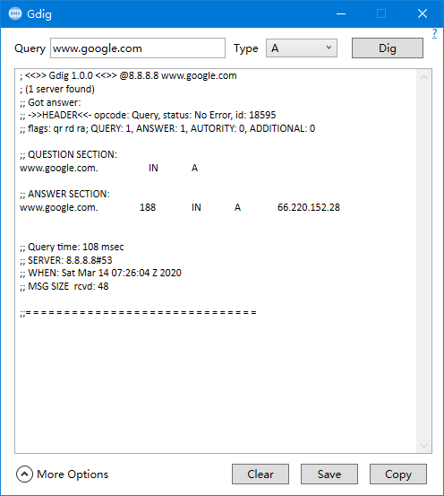

# Gdig

This is a GUI tool for `dig` in windows, depends on DnsClient, Inspired from [EZdig](http://www.eztk.com/products/ezdig.php).

It looks like:

## Dependencies

* .NET Framework 4.7.2

## Feature

* Remember all user configs after close window.
* Support setting dns servers by yourself.
* Support dig from a url, you can copy url from browser and paste it to the query field.